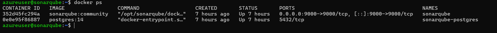
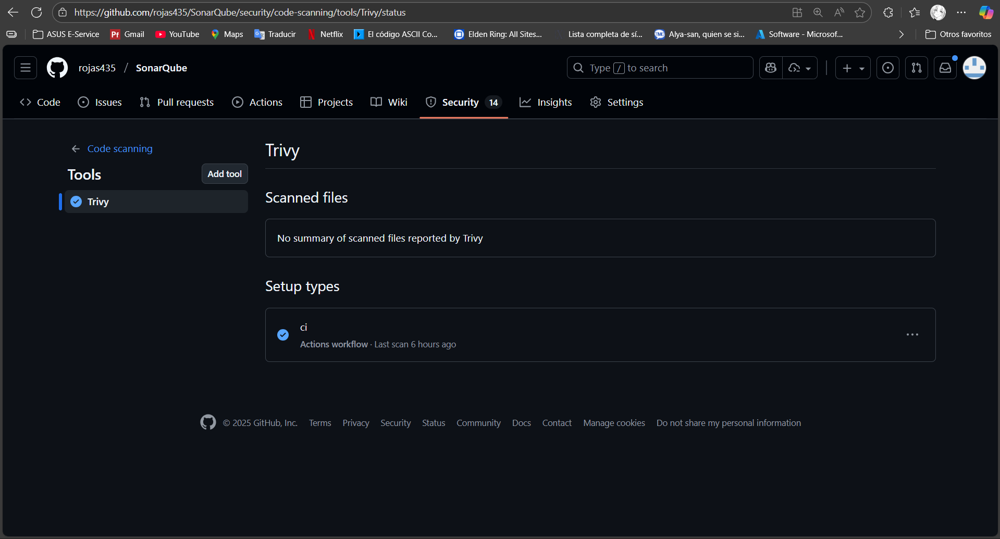
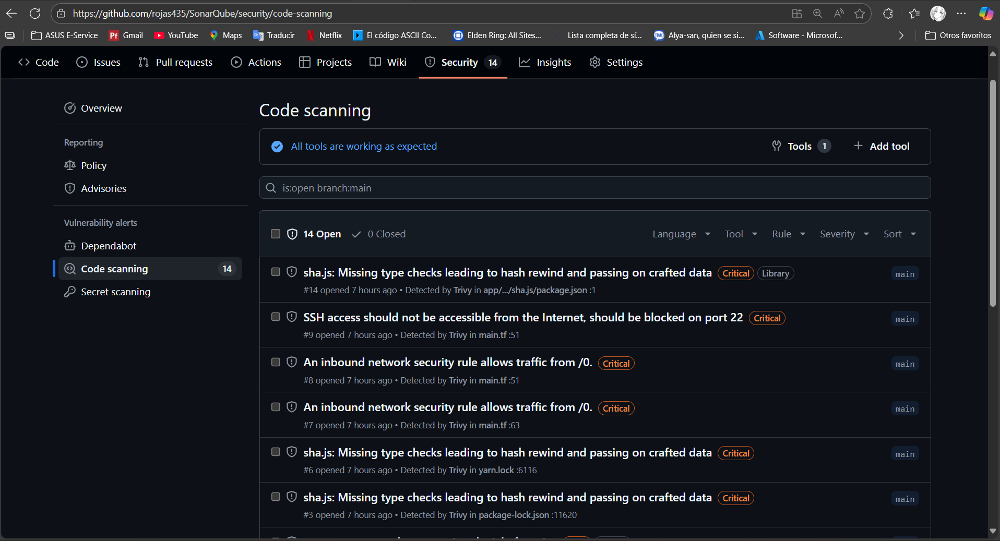

## SonarQube + Trivy CI/CD (con VM en Azure)

Este repositorio implementa un pipeline de análisis estático y seguridad con:

- SonarQube autoalojado en una máquina virtual Linux (Azure)

- Despliegue de la VM con Terraform (IaC)

- GitHub Actions para CI: análisis de código con SonarQube y escaneos de seguridad con Trivy (FS, IaC y contenedor)

  
La app es un backend NestJS, tomado del proyecto hecho en Computación en internet 3. El pipeline genera cobertura con Jest y la reporta a SonarQube, sin fallar aunque existan pruebas rojas.

---

  

## ¿Por qué así?

- SonarQube en VM: requisito del taller para alojar el servidor de análisis fuera de SaaS.
- Terraform: reproducible, parametrizable y controlado por código para crear la infraestructura (RG, VNet, NSG, IP, VM y cloud-init que arranca Docker + SonarQube + Postgres).
- Trivy: requisito para escaneo de vulnerabilidades y misconfiguraciones (código, IaC y contenedor).
- GitHub Actions: orquesta cobertura, escaneos y análisis, publicando resultados en SonarQube y en la pestaña Security de GitHub.

  

---

## Arquitectura

- Azure VM Ubuntu (Docker + Docker Compose)
   - Contenedores: `sonarqube:lts-community` y `postgres:14`
   - Puerto expuesto: 9000 (HTTP)
- Terraform (carpeta `infra/terraform`): crea RG, red, NSG (22/9000), IP pública y VM; usa cloud-init para instalar Docker y levantar SonarQube/DB.
- CI (`.github/workflows/ci.yml`):
   - Instala dependencias
   - Genera cobertura: `jest --coverage --testFailureExitCode=0`
   - Construye imagen `app:ci` (para escaneo de imagen)
   - Trivy FS/IaC/Image → sube SARIF a GitHub Security
   - SonarQube Scan + Quality Gate (contra la VM)

  

---

  

## Uso local (opcional)
- Cobertura local ignorando fallos:

   - `npm run cov:local`
   - Abre `coverage/lcov-report/index.html`

- Análisis local con SonarQube (Docker):

   1) `docker run --name sonarqube -d -p 9500:9000 sonarqube:lts-community`
   2) Genera token en http://localhost:9500 (admin/admin → cambiar contraseña → My Account → Security)
   3) `setx SONAR_TOKEN <token>` o en PowerShell ` $env:SONAR_TOKEN = '<token>'`
   4) `npm run sonar:local` (usa @sonar/scan y `sonar-project.properties`)

---  

## Despliegue de infraestructura (Terraform + workflow)

  

1) Secrets en GitHub (repo → Settings → Secrets and variables → Actions):
    - `AZURE_CREDENTIALS` (JSON para OIDC/login de Azure)
    - `VM_ADMIN_PASSWORD` (si usas autenticación por contraseña)

2) Workflow de Infra (`.github/workflows/infra.yml`):
    - `terraform init/plan` en cada cambio de IaC
    - `terraform apply` manual (solo en main)
    - Salida: URL pública de SonarQube (http://IP:9000)

  
3) Primera conexión a SonarQube en la VM:
    - http://IP_PUBLICA:9000 → admin/admin → cambiar contraseña → generar token

---

## CI: análisis y seguridad
Secrets requeridos en GitHub para el workflow `ci.yml`:

- `SONAR_HOST_URL` = `http://<IP_PUBLICA_VM>:9000`
- `SONAR_TOKEN` = token generado en SonarQube (VM)

  

Qué hace el CI:

- `npm ci || npm i --legacy-peer-deps`
- `npm run cov:local` (genera `coverage/lcov.info` sin fallar el job)

- Trivy:
   - FS (código/deps)
   - IaC (Terraform en `infra/terraform`)
   - Image (sobre `app:ci`)
   - Sube SARIF a Security → Code scanning alerts (categorías: `trivy-fs`, `trivy-iac`, `trivy-image`)
- SonarQube Scan + Quality Gate (lee cobertura desde `coverage/lcov.info`)

  

Dónde ver resultados:
- SonarQube (VM): métricas del proyecto, cobertura, bugs, code smells, vulnerabilidades.
- GitHub → Security → Code scanning alerts: hallazgos de Trivy por categoría.
- GitHub Actions: logs de cada paso y artefacto `coverage` (opcional para inspección).

  

---

  

## Troubleshooting rápido

- Sonar 0% cobertura en CI:
   - Asegúrate de que el paso "Generate coverage" corre antes del Sonar Scan y que `coverage/lcov.info` existe.
- 401 en Sonar (local o VM):
   - Usa un TOKEN de usuario, no contraseña; verifica `SONAR_HOST_URL` y `SONAR_TOKEN`.
- SonarQube tarda en arrancar:
   - Espera 1-2 minutos; revisa `docker logs sonarqube` en la VM.
- Trivy no muestra resultados en Security:
   - Revisa el run de Actions e ir a security y se vera en el code Scanning
  

---

  

## Stack principal

- Backend: NestJS (TypeScript)
- Infra: Terraform (Azure), Docker/Compose
- Análisis: SonarQube comunitario en VM
- Seguridad: Trivy (FS/IaC/Image)
- CI/CD: GitHub Actions

## Capturas

### Coverage

### Maquina virtual de docker

### Trivy

